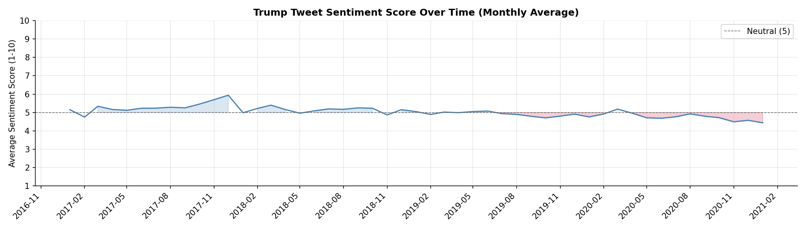
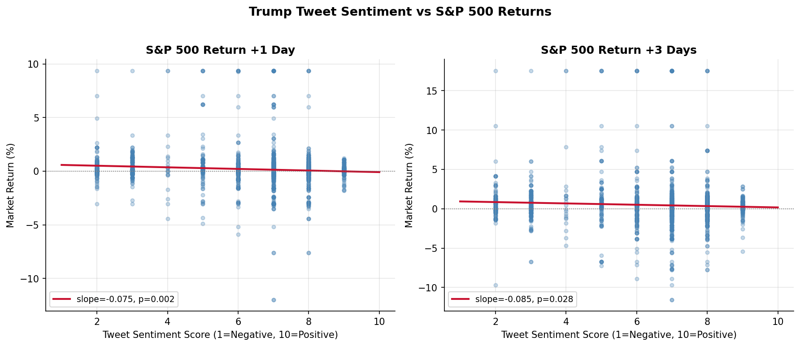

# Trump Market Sentiment

An event study analyzing the impact of Donald Trump's tweets on financial markets during his first presidential term (2017-2021).

Tweets are scored for market sentiment using the Claude API (1-10 scale), then matched with daily market data to measure returns in the days following each post.

## Results Summary





- **12,720 tweets** scored, of which **1,682 classified as market-relevant** (13%)
- A higher sentiment score (more positive tweet) is associated with **lower S&P 500 returns** at both +1 day and +3 days horizons (p < 0.001)
- More positive tweets are associated with **higher VIX** the following day (p < 0.01)
- The largest single-tweet market moves all cluster in the Covid-19 crash period — see [example tweets](Results.md#example-tweets-with-the-largest-market-impact)
- Full findings in [Results.md](Results.md)

## Methodology

**Sentiment Scoring** via Claude API:
- Score 1-10 (1 = very negative for markets, 10 = very positive)
- Category: economy / trade / geopolitics / domestic politics / other
- Only original tweets scored (retweets excluded)

**OLS Regression:**

$$AR_t = \alpha + \beta_1 \cdot \text{Sentiment} + \beta_2 \cdot \text{Category} + \varepsilon_t$$

where $AR_t$ is the market return in the +1d or +3d window after each tweet. HC3 heteroscedasticity-robust standard errors throughout.

## Markets Tracked

| Asset | Ticker | Rationale |
|-------|--------|-----------|
| S&P 500 | `^GSPC` | Broad US market |
| VIX | `^VIX` | Volatility proxy |
| USD/CHF | `CHF=X` | Safe haven currency |
| Gold | `GC=F` | Safe haven under uncertainty |

## Data Sources

| Source | Data |
|--------|------|
| [bpb27/trump_tweet_data_archive](https://github.com/bpb27/trump_tweet_data_archive) | Trump tweets 2017-2021 |
| [yfinance](https://github.com/ranaroussi/yfinance) | Market prices | 
| Anthropic Claude API | Sentiment scoring | 

## Setup

```bash
git clone https://github.com/YOUR_USERNAME/trump-market-sentiment.git
cd trump-market-sentiment
python -m venv venv
source venv/bin/activate        # Windows: venv\Scripts\activate
pip install -r requirements.txt
cp .env.example .env            # add your Anthropic API key
```

## Usage

```bash
python src/fetch_tweets.py      # download Trump tweets from GitHub archive
python src/fetch_market.py      # download market data via yfinance
python src/sentiment.py         # score tweets via Claude API
python src/merge.py             # merge tweets + sentiment + market data
python src/analysis.py          # OLS regression + figures
```

Results are written to `results/figures/` and `results/ols_results.txt`.

## Project Structure

```
trump-market-sentiment/
├── data/
│   ├── raw/                    # downloaded data (not tracked in git)
│   └── processed/              # merged dataset
├── src/
│   ├── fetch_tweets.py
│   ├── fetch_market.py
│   ├── sentiment.py
│   ├── merge.py
│   └── analysis.py
├── results/
│   ├── figures/
│   │   ├── sentiment_over_time.png
│   │   ├── score_vs_return.png
│   │   └── category_returns.png
│   └── ols_results.txt
├── RESULTS.md
├── config.yaml
└── requirements.txt
```

## Limitations

- **Causal identification is limited.** The OLS specification cannot rule out reverse causality: Trump may have posted optimistically following positive market movements, with subsequent mean-reversion driving the negative coefficient.
- **Daily granularity.** Using daily rather than intraday returns introduces noise and reduces precision around the timing of the tweet.
- **Sample period.** The dataset covers 2017-2021 only. Generalizability to Trump's second term is untested.
- **R² is low** (0.014-0.019), reflecting that tweet sentiment explains a small fraction of daily return variance. This is expected given the number of concurrent market-moving factors.
